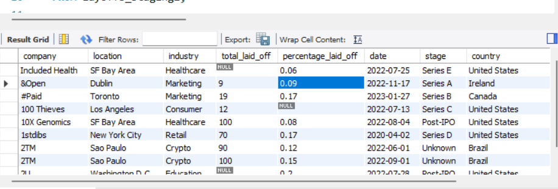
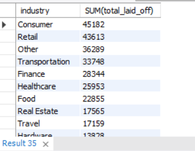
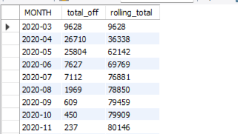

# Dataset Preview

## Insight:
### The dataset contains detailed information about company layoffs including company name, industry, location, layoffs count, funding stage, and country. This allows multi-dimensional analysis of workforce reductions across industries and regions.

# Layoffs by Industry

## Insight:
### Consumer and Retail industries recorded the highest layoffs. This suggests that consumer-focused businesses were heavily impacted by economic uncertainty and changing market demand.

# Layoffs by Country

## Insight:
### The United States experienced the largest number of layoffs. This is expected because many global technology companies and startups are headquartered in the U.S.

# Layoffs by Year

## Insight:
### Layoffs increased significantly in 2022 and 2023, reflecting a global economic slowdown and post-pandemic workforce restructuring in technology companies.

# Rolling Total Layoffs Over Time

## Insight:
### The rolling total shows a steady accumulation of layoffs over time, with sharp increases during major restructuring periods in the tech sector.

# Top Companies with Highest Layoffs

## Insight:
### Large technology companies such as Amazon, Meta, and Google contributed significantly to global layoffs due to large-scale restructuring and cost optimization strategies.

# Top Companies with Most Layoffs Per Year

## Insight:
### Different companies dominated layoffs in different years, indicating industry-wide adjustments rather than problems isolated to a single company.
